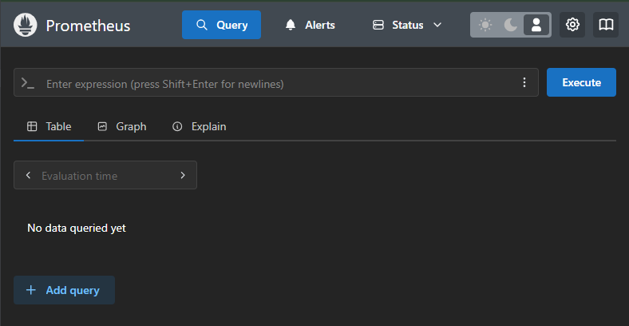
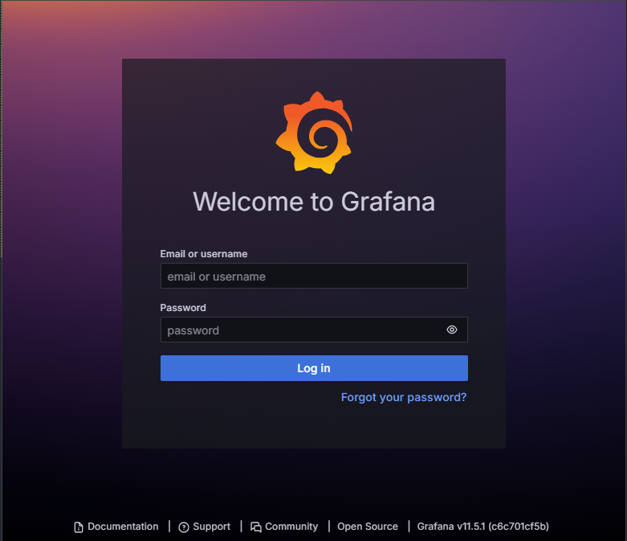

# Ход выполнения проекта
Тема проекта - Настройка облачной инфраструктуры в рамках миграции БД web приложения с MS SQL Server на PostgreSQL.
В процессе деплоя используется ansible.
## 1. Подготовка окружения
Кластер postgres развернут в облаке. Операционная система - Linux (Ubuntu 24.04). Параметры виртуальной машины: 8CPU, 16 RAM, 160Gb.
- Предварительно настроить репозитарии postgresql-17 [prerequisites_play.yml](vm1/prerequisites_play.yml):
```bash
ansible-playbook prerequisites_play.yml
```
- Как опция, можно перенести данные postgres на отдельный диск [move_postgresql_folder_play.yml](vm1/move_postgresql_folder_play.yml):
```bash
ansible-playbook move_postgresql_folder_play.yml
```
   
### 1.1. Установка postgresql
БД (PostgreSQL 17) установлена на хосте, приложение и агент мониторинга установлены в Docker.
- Подготовить плейбук для установки postgresql 17 [deploy_postgres_play.yml](vm1/deploy_postgres_play.yml)
- Запустить playbook
```bash
ansible-playbook deploy_postgres_play.yml
```
### 1.2. Первоначальная настройка конфигурации postgresql
- Первоначальные настройка выбраны исходя из параметров хоста:
```conf
shared_buffers = 4GB                # 25% от 16Gb
work_mem = 64MB                     # Определяет объем памяти, доступный для операций сортировки и хеширования в каждом запросе
maintenance_work_mem = 1GB          # Определяет объем памяти для операций обслуживания, таких как VACUUM, CREATE INDEX, ALTER TABLE
effective_cache_size = 12GB         # Оценка объема памяти, доступного для кэширования данных на уровне ОС. 75% от 16Gb
checkpoint_timeout = 15min          # Определяет, как часто PostgreSQL будет выполнять контрольные точки. 
checkpoint_completion_target = 0.9  # Определяет, какую часть времени между контрольными точками можно использовать для записи данных. 
wal_buffers = 16MB                  # Определяет объем памяти, выделенной для WAL
max_connections = 100               # 
autovacuum = on
synchronous_commit = off            # Определяет, должен ли PostgreSQL ждать записи WAL на диск перед подтверждением транзакции.
random_page_cost = 1.1              # Определяет стоимость случайного доступа к страницам на диске. Для ssd
seq_page_cost = 1.0                 # Определяет стоимость последовательного доступа к страницам на диске. Для ssd
log_statement = 'all'               #для отладки
log_duration = on                   #для отладки
```
### 1.3. Создание пользователя для приложения
Выполняется при настройке приложения.
## 2. Миграция MS SQL на postgresql
Выполняется коллегами.
### 2.1. Перенос таблиц
Выполняется коллегами.
### 2.2. Перенос функций и процедур
Выполняется коллегами.
### 2.3. Перенос представлений
Выполняется коллегами.
### 2.4. Перенос данных
Выполняется коллегами.
## 3. Настройка репликации (для демострации)
Для демонстрационных целей реплика будет настроена на ВМ2.
### 3.1. Конфигурация основного кластера
- Добавить в pg_hba.conf:
```conf
host    replication     replicator     0.0.0.0/0               md5
```
- Добавить в postgresql.conf:
```conf
wal_level = replica
max_wal_senders = 10
wal_keep_size = 1GB
```
- Создать пользователя для репликации
```bash
sudo -u postgres psql -c "CREATE ROLE replicator WITH REPLICATION LOGIN PASSWORD 'replicator_password';"
```
- Перезапустить кластер:
```bash
sudo pg_ctlcluster 17 main restart
```

### 3.2. Конфигурация реплики
- Создаем папку для реплики:
```bash
mkdir -p /mnt/data/replica
chown -R postgres:postgres /mnt/data/replica
```
- Создать кластер для реплики:
```bash 
sudo -u postgres pg_createcluster -d /mnt/data/replica 17 replica
```
- Удалить содержимое /mnt/data/replica
- Добавить файлик ~/.pgpass для пользователя postgres, чтоб подставлять пароль в плейбуке
```
[master ip]:[master port]:*:replicator:[replicator password]
```
- Запустить бэкап основного кластера
```bash 
sudo -u postgres pg_basebackup -U replicator -h 192.168.1.107 -p 5555 -R -D /mnt/data/replica
```
- Добавить нужные параметры в postgresql.conf
```conf
port=5556
listen_addresses = '*'
```
- Добавить правило доступа в pg_hba.conf
```conf
host all all 0.0.0.0/0 scram-sha-256
```
- Стартовать реплику
```bash
sudo pg_ctlcluster 17 replica start
```

- Можно запустить playbook [deploy_replica_play.yml](vm2/replica/deploy_replica_play.yml)
```bash
ansible-playbook deploy_replica_play.yml
```
## 4. Настройка мониторинга для кластера postgresql 17
- На виртуальной машине 1(ВМ1) развернут кластер postgresql 17 и docker.
- На ВМ2 развернут docker.
### 4.1. Развернуть на ВМ1 в docker postgres_exporter(для prometheus). Использовать docker compose.
- Создать нового пользователя и дать нужные права:
```bash
sudo -u postgres psql
```
```sql
CREATE USER pgexporter WITH PASSWORD 'secure_password'; --супер пароль
ALTER USER pgexporter SET SEARCH_PATH TO pg_catalog,pg_statistic;
GRANT CONNECT ON DATABASE postgres TO pgexporter;
GRANT CONNECT ON DATABASE prsdb TO pgexporter;
GRANT pg_monitor TO pgexporter;
```

- Создать директорию для конфигурации postgres_exporter:
```bash
mkdir -p /mnt/app/exporter
cd /mnt/app/exporter
```
- Создать файл /mnt/app/exporter/[docker-compose.yaml](vm1/exporter/docker-compose.yaml)
- Создать файл /mnt/app/exporter/.env и определить в нем необходимые значения
- Запустить контейнер:
```bash
sudo docker compose up -d
```
- Проверить метрики:
```bash
curl "http://localhost:9188/metrics"
```

### 4.2. Развернуть на ВМ2 в docker prometheus и graphana. Использовать docker compose.
- Создать директорию для конфигурации prometheus и grafana:
```bash
mkdir -p /mnt/app/prometheus_stack/{prometheus,grafana}
cd /mnt/app/prometheus_stack
```
- Создать файл /mnt/app/prometheus_stack/[docker-compose.yaml](vm2/prometheus_grafana/docker-compose.yaml)
- Создать файл /mnt/app/prometheus_stack/.env и определить в нем необходимые значения
- Создать файл /mnt/app/prometheus_stack/prometheus/[prometheus.yml](vm2/prometheus_grafana/prometheus.yml)
- Запустить контейнер:
```bash
sudo docker compose up -d
```
- Проверить доступность сервисов через браузер:



### 4.3. Настроить graphana для отображения метрик postgreSQL.
При первом входе использовать стандартые данные (admin:admin) поменять пароль на более безопасный.
- В боковом меню выбрать **Connections** -> **Data Sources**.
- Нажать **Add data source** и выберите **Prometheus**.
- В поле URL введите настроенный путь( например http://prometheus:9090 ) и нажмите **Save & Test**.
### 4.4. Сконфигурировать всю систему мониторинга.
- В боковом меню выбрать **Dashboards**.
- Нажать кнопку **New** -> **Import**.
- Введите ID дашборда - 9628 и нажать **Load**.
- Выбрать настроенный источник Prometheus нажать **Import**
- Наблюдать результат настройки:

## 5. Настройка бэкапирования
### 5.1. Создание структуры папок и скрипта
### 5.2. Настройка сервиса и расписания.
- Перенести файлы [fullbackup.sh](vm2/backup/fullbackup.sh), [postgres-backup.service](vm1/backup/postgres-backup.service) и [postgres-backup.timer](vm1/backup/postgres-backup.timer) на ВМ2.
- Запустить сервис:
```bash
sudo systemctl enable postgres-backup.timer
sudo systemctl start postgres-backup.timer
```
- Команды для проверки
```bash
sudo systemctl status postgres-backup.service 
sudo systemctl status postgres-backup.timer         #Проверка таймера
sudo journalctl -u postgres-backup.service -n 20    #проверка логов работы джобы 
```

