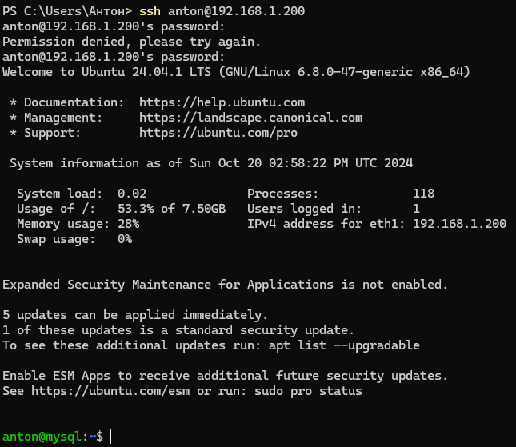

### 1. Создать ВМ с Ubuntu 20.04/22.04 или развернуть докер любым удобным способом
Виртуальная машина создана на локальной машине (hyper V: Ubuntu 24.04.1 LTS):

### 2. Поставить на нем Docker Engine
### 3. Сделать каталог /var/lib/postgres
### 4. Развернуть контейнер с PostgreSQL 15 смонтировав в него /var/lib/postgresql
### 5. Развернуть контейнер с клиентом postgres
### 6. Подключится из контейнера с клиентом к контейнеру с сервером и сделать таблицу с парой строк
### 7. Подключится к контейнеру с сервером с ноутбука/компьютера извне инстансов ЯО/места установки докера
### 8. Удалить контейнер с сервером
### 9. Создать его заново
### 10. Подключится снова из контейнера с клиентом к контейнеру с сервером
### 11. Проверить, что данные остались на месте
### 12. Оставляйте в ЛК ДЗ комментарии что и как вы делали и как боролись с проблемами