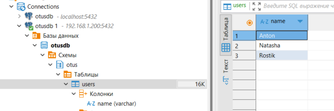
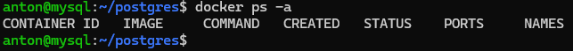
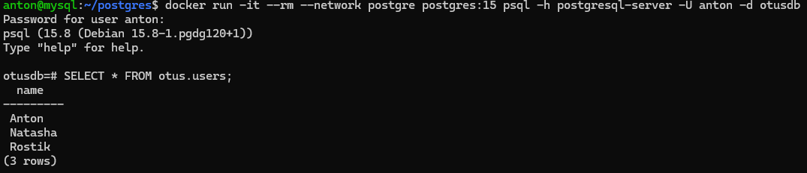

### 1. Создать ВМ с Ubuntu 20.04/22.04 или развернуть докер любым удобным способом
Виртуальная машина создана на локальной машине (hyper V: Ubuntu 24.04.1 LTS):

### 2. Поставить на нем Docker Engine
docker установлен:
```bash
docker --version
```

### 3. Сделать каталог /mnt/postgresql
```bash
sudo mkdir /mnt/postgresql
```
### 4. Развернуть контейнер с PostgreSQL 15 смонтировав в него /var/lib/postgresql
Создаем файл [docker-compose.yml](docker-compose.yml) в папке ~/postgre:
```bash
nano ~/postgre/docker-compose.yml
```
Запускаем сервер:
```bash
sudo mkdir /mnt/postgresql
cd ~/postgre
docker-compose up -d
```
### 5. Развернуть контейнер с клиентом postgres
Команда для запуска контейнера клиента:
```bash
docker run -it --rm --network postgre postgres:15 psql -h postgresql-server -U anton -d otusdb
```
### 6. Подключится из контейнера с клиентом к контейнеру с сервером и сделать таблицу с парой строк
```sql
CREATE SCHEMA otus;
CREATE TABLE otus.users (Name varchar);
INSERT INTO otus.users VALUES ('Anton'),('Natasha'),('Rostik');
```

### 7. Подключится к контейнеру с сервером с ноутбука/компьютера извне инстансов ЯО/места установки докера
Подключаемся к виртуалке из бобра:

### 8. Удалить контейнер с сервером
Удаляем сервер:
```bash
docker-compose down;
```

### 9. Создать его заново
```bash
docker-compose up -d;
```
### 10. Подключится снова из контейнера с клиентом к контейнеру с сервером
Команда для запуска контейнера клиента:
```bash
docker run -it --rm --network postgre postgres:15 psql -h postgresql-server -U anton -d otusdb
```
### 11. Проверить, что данные остались на месте
```sql
SELECT * FROM otus.users;
```

### 12. Оставляйте в ЛК ДЗ комментарии что и как вы делали и как боролись с проблемами