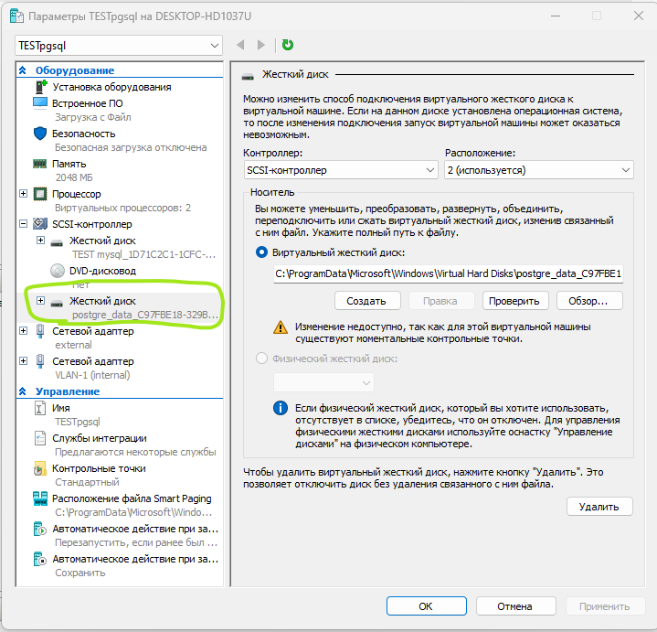
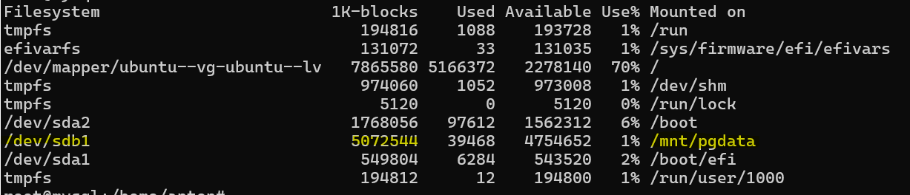

## Описание/Пошаговая инструкция выполнения домашнего задания:
### 1. Создайте виртуальную машину c Ubuntu 20.04/22.04 LTS в ЯО/Virtual Box/докере
   
Виртуальная машина создана в hyper V на ноутбуке.

### 2. Поставьте на нее PostgreSQL 15 через sudo apt

```
# Выполнялось под root'ом
echo "deb http://apt.postgresql.org/pub/repos/apt $(lsb_release -cs)-pgdg main" > /etc/apt/sources.list.d/postgresql.list
apt install gnupg2
curl -fsS https://www.postgresql.org/media/keys/ACCC4CF8.asc | gpg2 --dearmor -o /etc/apt/trusted.gpg.d/postgresql.gpg
apt update
apt install postgresql-15
```

### 3. Проверьте что кластер запущен через sudo -u postgres pg_lsclusters

```
anton@mysql:~$ sudo -u postgres pg_lsclusters
[sudo] password for anton:
Ver Cluster Port Status Owner    Data directory              Log file
15  main    5432 online postgres /var/lib/postgresql/15/main /var/log/postgresql/postgresql-15-main.log
```

### 4. Зайдите из под пользователя postgres в psql и сделайте произвольную таблицу с произвольным содержимым
postgres=# create table test(c1 text);
postgres=# insert into test values('1');
\q

```
anton@mysql:~$ sudo psql -h localhost -U postgres
Password for user postgres:
psql (15.8 (Ubuntu 15.8-1.pgdg24.04+1))
Type "help" for help.

postgres=# create table test(c1 text);
CREATE TABLE
postgres=# insert into test values('1');
INSERT 0 1
postgres=# \q
anton@mysql:~$
```

### 5. Остановите postgres например через sudo -u postgres pg_ctlcluster 15 main stop

```
anton@mysql:~$ sudo -u postgres pg_ctlcluster 15 main stop
Warning: stopping the cluster using pg_ctlcluster will mark the systemd unit as failed. Consider using systemctl:
  sudo systemctl stop postgresql@15-main
anton@mysql:~$ sudo systemctl stop postgresql@15-main
anton@mysql:~$ sudo -u postgres pg_ctlcluster 15 main status
pg_ctl: no server running
```

### 6. Создайте новый диск к ВМ размером 10GB

Сделал диск на 5G:


### 7. Добавьте свеже-созданный диск к виртуальной машине - надо зайти в режим ее редактирования и дальше выбрать пункт attach existing disk



### 8. Проинициализируйте диск согласно инструкции и подмонтировать файловую систему, только не забывайте менять имя диска на актуальное, в вашем случае это скорее всего будет /dev/sdb - https://www.digitalocean.com/community/tutorials/how-to-partition-and-format-storage-devices-in-linux

### 9. Перезагрузите инстанс и убедитесь, что диск остается примонтированным (если не так смотрим в сторону fstab)



### 10. Сделайте пользователя postgres владельцем /mnt/data - chown -R postgres:postgres /mnt/data/

```
root@mysql:/home/anton# chown -R postgres:postgres /mnt/pgdata/
root@mysql:/home/anton# ls -al /mnt
total 16
drwxr-xr-x  4 root     root     4096 Oct 26 10:23 .
drwxr-xr-x 23 root     root     4096 Oct 15 17:32 ..
drwxr-xr-x  4 postgres postgres 4096 Oct 26 10:18 pgdata
drwxr-xr-x  3 anton    anton    4096 Oct 20 16:51 postgresql
```

### 11. Перенесите содержимое /var/lib/postgres/15 в /mnt/data - mv /var/lib/postgresql/15 /mnt/data

```
root@mysql:/home/anton# ls -al /mnt/pgdata/main/
total 92
drwx------ 19 postgres postgres 4096 Oct 26 10:19 .
drwxr-xr-x  4 postgres postgres 4096 Oct 26 10:18 ..
drwx------  5 postgres postgres 4096 Oct 24 17:25 base
drwx------  2 postgres postgres 4096 Oct 26 10:20 global
drwx------  2 postgres postgres 4096 Oct 24 17:25 pg_commit_ts
drwx------  2 postgres postgres 4096 Oct 24 17:25 pg_dynshmem
drwx------  4 postgres postgres 4096 Oct 26 10:24 pg_logical
drwx------  4 postgres postgres 4096 Oct 24 17:25 pg_multixact
drwx------  2 postgres postgres 4096 Oct 24 17:25 pg_notify
drwx------  2 postgres postgres 4096 Oct 24 17:25 pg_replslot
drwx------  2 postgres postgres 4096 Oct 24 17:25 pg_serial
drwx------  2 postgres postgres 4096 Oct 24 17:25 pg_snapshots
drwx------  2 postgres postgres 4096 Oct 26 10:19 pg_stat
drwx------  2 postgres postgres 4096 Oct 24 17:25 pg_stat_tmp
drwx------  2 postgres postgres 4096 Oct 24 17:25 pg_subtrans
drwx------  2 postgres postgres 4096 Oct 24 17:25 pg_tblspc
drwx------  2 postgres postgres 4096 Oct 24 17:25 pg_twophase
-rw-------  1 postgres postgres    3 Oct 24 17:25 PG_VERSION
drwx------  3 postgres postgres 4096 Oct 24 17:25 pg_wal
drwx------  2 postgres postgres 4096 Oct 24 17:25 pg_xact
-rw-------  1 postgres postgres   88 Oct 24 17:25 postgresql.auto.conf
-rw-------  1 postgres postgres  130 Oct 26 10:19 postmaster.opts
-rw-------  1 postgres postgres   99 Oct 26 10:19 postmaster.pid
```

### 12. Попытайтесь запустить кластер - sudo -u postgres pg_ctlcluster 15 main start

```
anton@mysql:~$ sudo -u postgres pg_ctlcluster 15 main status
pg_ctl: server is running (PID: 921)
/usr/lib/postgresql/15/bin/postgres "-D" "/var/lib/postgresql/15/main" "-c" "config_file=/etc/postgresql/15/main/postgresql.conf"
```

### 13. Напишите получилось или нет и почему

Получилось... хаха... просто я еще линк сделал:
```bash
ln -s /mnt/pgdata/main /var/lib/postgresql/15/main
```
Думаю что без этого всё сломалось бы...

### 14. Задание: найти конфигурационный параметр в файлах раположенных в /etc/postgresql/15/main который надо поменять и поменяйте его

Ладно, поменяю.... postgresql.conf :)

### 15. Напишите что и почему поменяли

Добавил строку 
```conf
data_directory = '/mnt/pgdata/main' 
```
она указывает где искать данные.

### 16. Попытайтесь запустить кластер - sudo -u postgres pg_ctlcluster 15 main start

```
anton@mysql:~$ sudo -u postgres pg_ctlcluster 15 main status
pg_ctl: server is running (PID: 1822)
/usr/lib/postgresql/15/bin/postgres "-D" "/mnt/pgdata/main" "-c" "config_file=/etc/postgresql/15/main/postgresql.conf"
```

### 17. Напишите получилось или нет и почему

Всё чики пуки )) Короче можно 2мя способами...

### 18. Зайдите через через psql и проверьте содержимое ранее созданной таблицы

```
anton@mysql:~$ sudo psql -h localhost -U postgres
Password for user postgres:
psql (15.8 (Ubuntu 15.8-1.pgdg24.04+1))
Type "help" for help.

postgres=#
postgres=# select * from test;
 c1
----
 1
(1 row)

postgres=#
```

### 19. Задание со звездочкой *: не удаляя существующий инстанс ВМ сделайте новый, поставьте на его PostgreSQL, удалите файлы с данными из /var/lib/postgres, перемонтируйте внешний диск который сделали ранее от первой виртуальной машины ко второй и запустите PostgreSQL на второй машине так чтобы он работал с данными на внешнем диске, расскажите как вы это сделали и что в итоге получилось.

- Чтоб не делать много работы я клонировал VM. Предварительно отключил диск.
- Зашел на новую виртуалку.
- Поменял IP
- Поменял имя хоста
- Подключил диск pgdata и рестартанул машину.
- Проверил postgresql:

```
anton@PG2:~$ sudo -u postgres pg_ctlcluster 15 main status
[sudo] password for anton:
pg_ctl: server is running (PID: 924)
/usr/lib/postgresql/15/bin/postgres "-D" "/mnt/pgdata/main" "-c" "config_file=/etc/postgresql/15/main/postgresql.conf"
anton@PG2:~$ sudo psql -h localhost -U postgres
Password for user postgres:
psql (15.8 (Ubuntu 15.8-1.pgdg24.04+1))
Type "help" for help.

postgres=# select * from test;
 c1
----
 1
(1 row)

postgres=#
```

Стартовать получилось, но не одновременно две тачки. Видимо нужен другой подход к созданию дисков в hyper-V. 